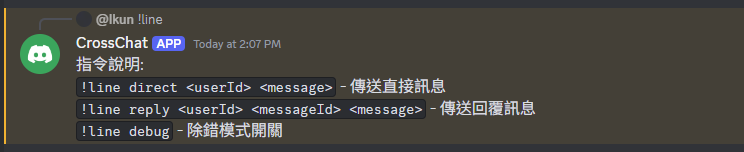
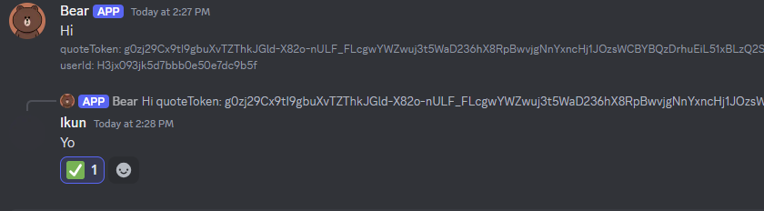
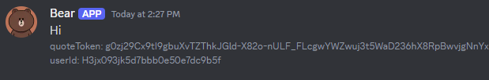

# CrossChat

在 LINE 和 Discord 平台之間跨平台通信。

## 功能

- 將來自 LINE 的消息轉發到 Discord 並顯示用戶歸屬
- 使用命令從 Discord 向 LINE 用戶發送消息
- 易於部署和配置
- 實時消息同步

## 先決條件

- Node.js (v14.0.0 或更高版本)
- 擁有消息 API 訪問權限的 LINE Bot 帳戶
- 具有適當權限和 Webhook 的 Discord 機器人

## 安裝

1. 複製此存儲庫：
    ```bash
    git clone https://github.com/Ikun-git/CrossChat.git
    cd crosschat
    ```

2. 安裝依賴項：
    ```bash
    npm install
    ```

3. 配置環境變量：
    創建一個 `.env` 文件並填入以下信息：
    ```env
    DISCORD_BOT_TOKEN=your_discord_bot_token
    DISCORD_CLIENT_ID=your_discord_client_id
    DISCORD_GUILD_ID=your_discord_guild_id
    DISCORD_WEBHOOK_URL=your_discord_webhook_url
    LINE_CHANNEL_ID=your_line_channel_id
    LINE_CHANNEL_SECRET=your_line_channel_secret
    LINE_CHANNEL_ACCESS_TOKEN=your_line_channel_access_token
    ```

## 使用方法

### 啟動應用程式

同時啟動兩個機器人：
```bash
npm start
```

開發模式下自動重啟：
```bash
npm run dev
```
#### 建議在 [Glitch](https://glitch.com/) 上佈署Line端，因為只會在收到訊息時開機，免費版有1000小時的時間。
##### 跑七個禮拜的結果


### Discord 指令

- `!cc` - 顯示指令說明
- `!cc direct <userId> <message>` - 發送直接訊息
- `!cc reply <userId> <quoteToken> <message>` - 發送回覆訊息

### 使用範例

以下是機器人的一些使用範例截圖：

#### 指令說明


#### 回覆訊息


#### 收到訊息通知


#### 發送訊息


## 參考

- [LINE Messaging API](https://developers.line.biz/en/docs/messaging-api/)
- [Discord.js](https://discord.js.org/)
